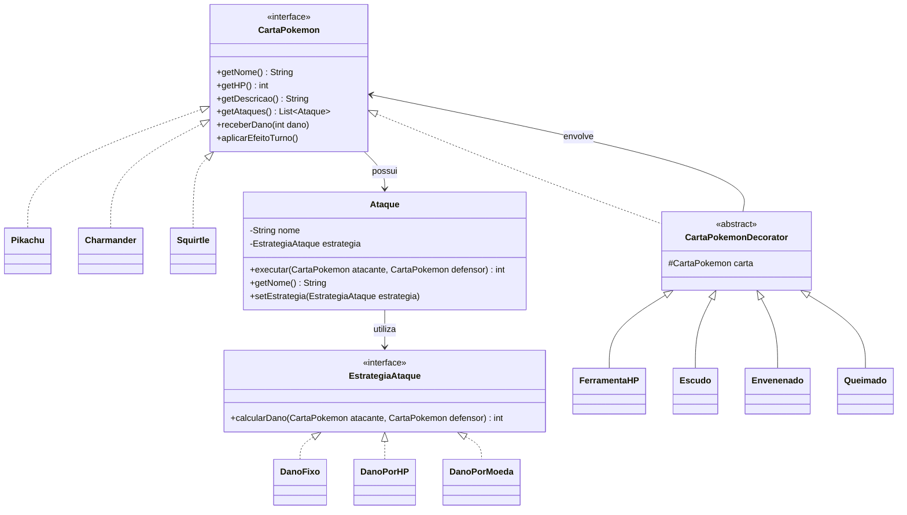
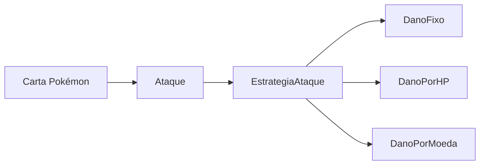
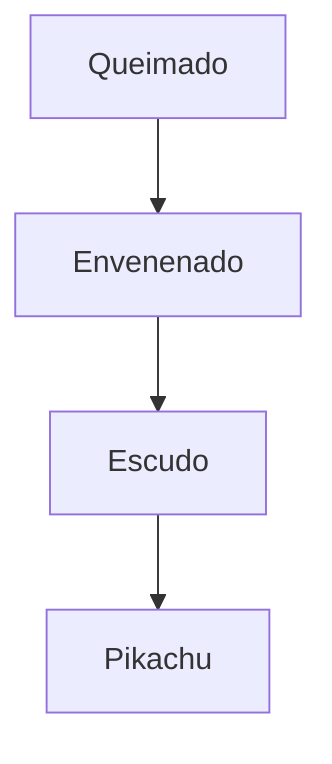
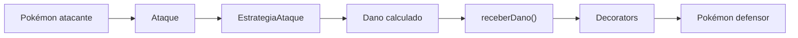

# CartasTCG

Projeto em Java inspirado em cartas Pokémon TCG, desenvolvido com o objetivo de aplicar e demonstrar os padrões de projeto **Strategy** e **Decorator**.

A aplicação simula uma batalha simplificada entre cartas Pokémon, permitindo que cada Pokémon possua diferentes ataques e receba modificações durante a execução.

---

## Objetivo

O projeto busca representar dois comportamentos principais:

* diferentes formas de calcular o dano de um ataque;
* modificações dinâmicas aplicadas às cartas Pokémon.

Para isso, foram utilizados os padrões:

* **Strategy** para definir diferentes formas de cálculo de dano;
* **Decorator** para adicionar novos comportamentos às cartas sem modificar suas classes originais.

---

# Arquitetura



---

# Strategy

O padrão **Strategy** é utilizado para separar o ataque da lógica usada para calcular seu dano.

A classe `Ataque` não precisa saber como o dano será calculado.

Ela apenas possui uma implementação de:

```java
EstrategiaAtaque
```

e delega o cálculo para ela:

```java
int dano = estrategia.calcularDano(atacante, defensor);
```

Isso permite utilizar diferentes estratégias sem modificar a classe `Ataque`.

## Estratégias implementadas

### DanoFixo

Sempre retorna um valor previamente definido.

Exemplo:

```text
Thunder Shock
Dano: 30
```

Independentemente do HP ou do defensor, o ataque causa o valor configurado.

---

### DanoPorHP

Calcula o dano utilizando o HP atual do Pokémon atacante.

Exemplo:

```text
Pikachu
HP: 70

Dano calculado:
70 / 2 = 35
```

---

### DanoPorMoeda

Simula ataques do Pokémon TCG que dependem do resultado de uma moeda.

Exemplo:

```text
Dano definido: 40

Cara:
40 de dano

Coroa:
0 de dano
```

O valor do dano não é aleatório. Apenas o resultado da moeda determina se o dano será aplicado.

---

# Relação entre Pokémon, Ataque e Strategy

A estrutura funciona da seguinte maneira:



Por exemplo:

```text
Pikachu
│
├── Thunder Shock
│       └── DanoFixo
│
└── Electro Ball
        └── DanoPorHP
```

Cada ataque possui sua própria estratégia.

---

# Decorator

O padrão **Decorator** permite adicionar comportamentos a uma carta Pokémon durante a execução sem modificar diretamente a classe original.

Por exemplo:

```java
CartaPokemon pikachu = new Pikachu();

pikachu = new Escudo(pikachu, 10);
pikachu = new Envenenado(pikachu);
```

O objeto passa a possuir a seguinte estrutura:

```text
Envenenado
    ↓
Escudo
    ↓
Pikachu
```

Cada Decorator guarda internamente a carta que está envolvendo.

---

## FerramentaHP

Adiciona HP à carta.

Exemplo:

```text
Pikachu

HP original:
70

FerramentaHP:
+30

HP retornado:
100
```

O objeto `Pikachu` original não precisa ser modificado.

---

## Escudo

Reduz o dano recebido pela carta.

Exemplo:

```text
Ataque:
30 de dano

Escudo:
-10

Dano recebido pelo Pikachu:
20
```

Isso acontece porque o `Escudo` sobrescreve:

```java
receberDano(int dano)
```

e modifica o valor antes de passá-lo para a carta que está envolvendo.

---

## Envenenado

Adiciona um efeito de veneno à carta.

No fim de cada turno:

```text
-10 HP
```

O efeito é executado através de:

```java
aplicarEfeitoTurno();
```

---

## Queimado

Funciona de forma semelhante ao veneno, mas causa:

```text
-20 HP por turno
```

---

# Encadeamento dos Decorators

Os Decorators podem ser empilhados.

Exemplo:

```java
CartaPokemon pikachu = new Pikachu();

pikachu = new Escudo(pikachu, 10);
pikachu = new Envenenado(pikachu);
pikachu = new Queimado(pikachu);
```

A estrutura formada é:



Quando:

```java
pikachu.aplicarEfeitoTurno();
```

o fluxo percorre os Decorators:

```text
Queimado
↓
aplica seu efeito

Envenenado
↓
aplica seu efeito

Escudo
↓
repassa

Pikachu
↓
fim da cadeia
```

Cada Decorator executa seu comportamento e chama o mesmo método da carta que está envolvendo.

---

# Aplicação de dano

A classe `Ataque` utiliza a Strategy para descobrir quanto dano deve ser causado:

```java
int dano = estrategia.calcularDano(atacante, defensor);
```

Depois aplica o valor ao defensor:

```java
defensor.receberDano(dano);
```

O fluxo completo é:



Por exemplo:

```text
Pikachu
↓
Thunder Shock
↓
DanoFixo
↓
30 de dano
↓
Escudo do defensor
↓
reduz 10
↓
Pokémon recebe 20
```

---

# Pokémon implementados

Atualmente o projeto possui:

### Pikachu

```text
HP: 70

Thunder Shock
→ DanoFixo

Electro Ball
→ DanoPorHP
```

### Charmander

```text
HP: 60

Scratch
→ DanoFixo

Ember
→ DanoPorMoeda
```

### Squirtle

```text
HP: 70

Tackle
→ DanoFixo

Water Gun
→ DanoPorHP
```

---

# Estrutura do projeto

```text
src/
│
├── battle/
│   └── Ataque.java
│
├── decorator/
│   ├── CartaPokemonDecorator.java
│   ├── FerramentaHP.java
│   ├── Escudo.java
│   ├── Envenenado.java
│   └── Queimado.java
│
├── model/
│   ├── CartaPokemon.java
│   ├── Pikachu.java
│   ├── Charmander.java
│   └── Squirtle.java
│
├── strategy/
│   ├── EstrategiaAtaque.java
│   ├── DanoFixo.java
│   ├── DanoPorHP.java
│   └── DanoPorMoeda.java
│
└── Main.java
```

---

# Resumo dos padrões

| Padrão    | Responsabilidade                                               |
| --------- | -------------------------------------------------------------- |
| Strategy  | Define como o dano de um ataque é calculado                    |
| Decorator | Adiciona ou modifica comportamentos de uma carta dinamicamente |

A principal relação do projeto pode ser resumida como:

```text
CartaPokemon
     ↓
possui
     ↓
Ataque
     ↓
utiliza
     ↓
EstrategiaAtaque
```

Enquanto o Decorator funciona paralelamente:

```text
Decorator
    ↓
Decorator
    ↓
CartaPokemon
```

Dessa forma, o cálculo dos ataques e as modificações das cartas permanecem separados, permitindo adicionar novas estratégias, novos Pokémon e novos efeitos sem alterar grande parte do código existente.
